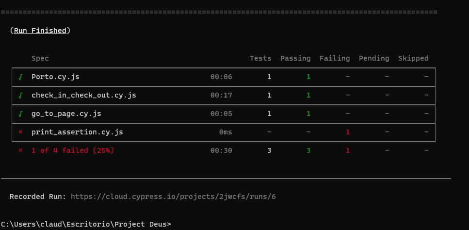

# BookingbyClod
This challenge is implemented with Cypress + JavaScript or TypeScript

## Cypress enables you to write all types of tests:

* End-to-end tests
* Integration tests
* Unit tests

## Set up instructions
You need google chrome installed locally but supported: Frirefox, Edge, Electron, Brave.

1. Install cypress https://www.cypress.io/
2. Install node.js https://nodejs.org/en/
3. Install dependencies:

            install node.js

## Check versions:

1. node -v
2. npm -v
3. npx cypress -v

## IDE- Visual Studio or Intellij:

1. https://www.jetbrains.com/es-es/idea/
2. https://code.visualstudio.com/

## Get start project create package.json

1. npm init -y
2. npm install cypress
3. npx cypress verify

## How tu use Cypress

1. Setup test
2. Write tests
3. Run tests
4. Debug

## Execute the tests

            npx cypress open

## Generate report with allure
 
            npx cypress run --record --key 07a9bf24-921d-4e3e-ab90-e160dcc797cc
            
            
            

